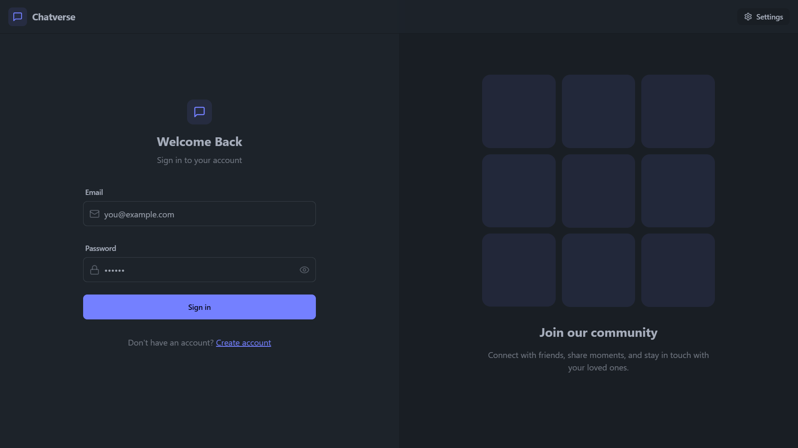

# Chatverse 

Chatverse is a real-time chat application built using the MERN stack (MongoDB, Express, React, Node.js), Tailwind CSS, Daisy UI, and Socket.IO. It enables seamless, instant messaging with dynamic chatrooms, robust WebSocket integration, and a modern, user-friendly interface.

## Tech Stack

- **Frontend:** React.js, Tailwind CSS, Daisy UI
- **Backend:** Node.js, Express.js
- **Database:** MongoDB
- **Real-time Communication:** Socket.IO
- **Styling:** Tailwind CSS, Daisy UI

## Features

- **Real-time Messaging:** Users can send and receive messages instantly using WebSockets.
- **User Authentication:** Secure user registration and login.
- **Private and Group Chats:** Chat with individual users or in group chatrooms.
- **Responsive Design:** A dynamic interface that works on all devices, powered by Tailwind CSS and Daisy UI.
- **Message Notifications:** Instant notifications for new messages.
- **User Presence:** Display online/offline status of users.

## Installation

1. Clone the repository:
    # git clone https://github.com/veeraj2404/chatverse
    # cd chatverse

2. Install Backend Dependencies:

    In the backend folder:

    cd backend
    npm install

3. Install Frontend Dependencies:

    In the frontend folder:

    cd frontend
    npm install

4. Setup Environment Variables:

    # In backend/.env, configure the necessary environment variables (MongoDB URI, JWT Secret, etc.).

    MONGO_URI=your_mongo_connection_string
    JWT_SECRET=your_jwt_secret
    PORT=5001

5. Run the Application:

    Start the backend server:

    npm run dev
    Start the frontend React app:

    npm  run dev